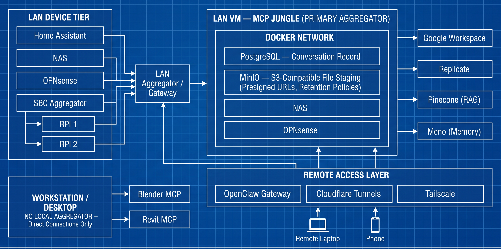

# MCP Deployment Architecture

Living documentation of the MCP (Model Context Protocol) deployment architecture used across Daniel Rosehill's agentic AI setup.

This repository describes the **current** architecture. Dated snapshots of earlier iterations live under [`iterations/`](iterations/) — the README is kept clean of changelog so it always shows the latest model.

### Anti-hairpin note

LAN clients reach the LAN VM directly; the external hostname is resolved at the DNS level so traffic does not loop out through the tunnel and back in.

## What this repo is

This is a documentation repository, not a code repository. It captures the current shape of the deployment, the reasoning behind it, and — under `iterations/` — the trajectory.

The architecture is a **work in progress** that is updated periodically. Approaches change as MCP itself evolves and as the practical edges of file transfer, authentication, tool discovery, and aggregation push back.

## Goals

The end goal — not yet fully realised — is an MCP deployment **decoupled from any single agentic framework**. Today, much of it is consumed via Claude (Code and claude.ai), but the design intent is that the MCP servers, aggregation layer, and supporting services should be reusable from any compliant client.

The recurring problem areas this architecture is trying to address:

- **File transfer** — MCP's JSON-RPC has no binary channel; tools that take file paths assume server-local filesystems.
- **Authentication** — managing OAuth, tokens, and per-account scoping across many providers and machines.
- **Tool discovery** — finding the right tool across dozens of servers without overwhelming the model's context.
- **Aggregation vs. direct connection** — when to multiplex through an aggregator and when a direct client connection is simpler.

## Current architecture

### Single LAN aggregator

A single MCP aggregator runs on a virtual machine on the LAN. It is the destination for all MCP servers unless one truly cannot run remotely.

Hosts connections to remote SaaS APIs (Google Workspace, Replicate, Pinecone, Meno, etc.) and to infrastructure services on the Docker network (e.g., PostgreSQL for conversation records). The aggregation layer is **MCP Jungle** (formerly MetaMCP).

### Workstation — direct connections only

There is **no workstation-local aggregator**. The desktop client makes **direct point-to-point connections** to the small set of servers that genuinely have to run locally:

- MCPs that require **local device access** (e.g., Blender, Revit, anything driving local desktop software).
- MCPs that need **direct local filesystem access** and have no remote-file-transfer story.
- MCPs that are simply **too cumbersome to configure remotely** (e.g., transcription tools expecting local audio hardware).

Everything else lives on the LAN aggregator.

### File staging — MinIO on the LAN server

File transfer for MCP tools is handled by **MinIO** running on the LAN VM:

- **S3-compatible API** accessible from inside and outside the LAN.
- **Presigned URLs** for clients without filesystem access (phones, browsers, remote agents).
- **Lifecycle / retention policies** auto-prune temporary staging artifacts so storage doesn't accumulate.

This replaces an earlier lightweight HTTP staging microservice (see [`iterations/v1-2026-04-26.md`](iterations/v1-2026-04-26.md)).

### Remote access

Access to the LAN aggregator from outside the network:

- **Cloudflare Tunnels** — stable, publicly-routable access without exposing ports.
- **Tailscale** — private mesh networking when on the move.

An **OpenClaw gateway** sits in front of the VM aggregator and handles routing for both local and remote clients. The same MCP servers are reachable whether the client is on the LAN or remote.

### LAN device integration

Lightweight MCP servers run directly on local LAN devices:

- **Home Assistant** (home automation)
- **NAS** (network storage)
- **OPNsense** (firewall/router)
- **SBC Aggregator** — a dedicated single-board computer that aggregates signals from other SBCs (RPi 1, RPi 2, etc.)

These device-level MCPs feed into a **LAN Aggregator/Gateway**, which connects upward into the VM aggregator. Devices expose only their own tools; the aggregator composes them into a unified interface.

## Design rationale

### Client portability

Centralising MCPs on a network-hosted VM rather than on any single client device means the tool surface is available to any compliant AI client — desktop apps, CLI tools, remote agents — without per-client configuration. New clients just point at the aggregator.

### Location flexibility

The Cloudflare + Tailscale layer makes the same MCP servers reachable on the LAN or remotely, with no VPN juggling or port forwarding.

### Mitigating tool bloat and context load

Hierarchical aggregation deliberately prevents tool bloat. Rather than loading every MCP tool into every client session:

- LAN devices expose focused, narrow tool sets.
- The LAN aggregator/gateway composes device tools into logical groups.
- The VM aggregator presents a curated surface to clients.
- The workstation handles only the exceptions that genuinely need local access — and now does so via direct connections rather than a second aggregator layer.

This keeps any single client's context window free from hundreds of irrelevant tools and makes the system easier to reason about, debug, and extend.

## Iterations

Dated snapshots of earlier versions of this architecture live in [`iterations/`](iterations/). See that folder's README for the index.

## Diagrams

Diagrams are kept under [`diagrams/`](diagrams/), versioned in step with the iterations:

- `diagrams/v2/1.png` — current architecture (header image above)
- `diagrams/v1/` — earlier two-tier model with workstation-local aggregator and HTTP staging service

All diagrams generated with **Nano Banana 2** (`fal-ai/nano-banana-2`) via Fal AI.
