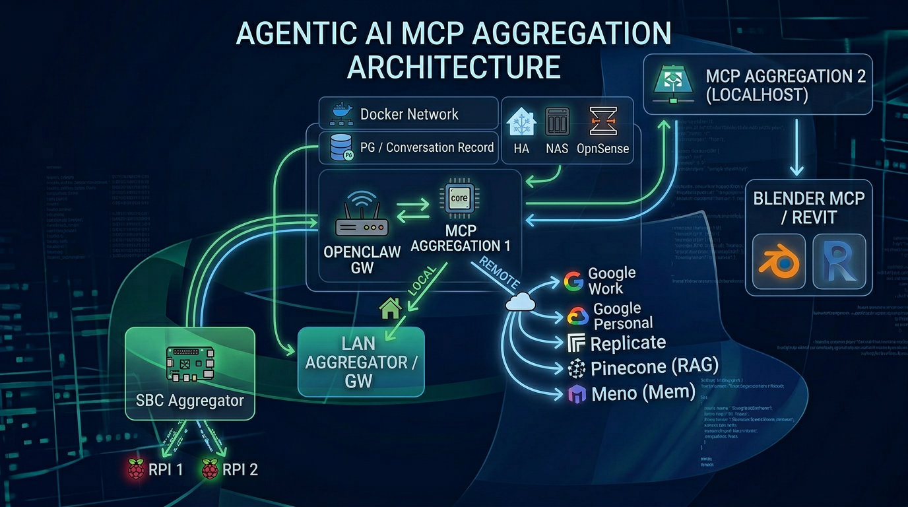

# MCP Aggregation Architecture

Documentation of the MCP (Model Context Protocol) aggregation architecture used across Daniel Rosehill's agentic AI setup.

## Architecture Overview

This architecture uses a two-tier MCP aggregation model designed around three core principles: **client portability**, **location flexibility**, and **context load management**.

## The Two Aggregators

### MCP Aggregation 1 (LAN VM) — Default

The primary MCP aggregator runs on a local virtual machine on the LAN. This is the default destination for all MCP servers unless there is a specific reason to run them locally.

MCP servers hosted here include connections to remote SaaS APIs (Google Workspace, Replicate, Pinecone, Meno) as well as infrastructure services running within the Docker network (PostgreSQL for conversation records, etc.).

The aggregation layer used here is MCP Jungle (referenced in the diagram as "MCP Aggregation 1"; note: the project was formerly known as MetaMCP and is now called MCP Jungle).

### MCP Aggregation 2 (Localhost) — Exception-Based

A second MCP aggregator runs on the local desktop machine. This is used only when one of the following conditions applies:

- The MCP **requires local device access** to function (e.g., Blender MCP, Revit MCP, or any tool that drives local desktop software).
- The MCP **does not support file transfer to a remote** and needs direct filesystem access.
- The MCP is **too cumbersome to configure remotely** (e.g., a transcription MCP that expects local audio hardware or file paths).

If none of these conditions apply, the MCP belongs on the LAN VM, not localhost.

## Remote Access

Access to the LAN VM's MCP aggregator from outside the local network is provided via:

- **Cloudflare Tunnels** — for stable, publicly-routable access without exposing ports.
- **Tailscale** — for private mesh networking when on the move.

An **OpenClaw gateway** sits in front of the VM aggregator, handling routing for both local and remote clients.

This means that regardless of whether the client is on the LAN or connecting from a remote location, the same MCP servers are reachable securely.

## LAN Device Integration

Lightweight MCP servers run directly on local LAN devices such as:

- **Home Assistant** (home automation)
- **NAS** (network storage)
- **OPNsense** (firewall/router)
- **SBC Aggregator** — a dedicated single-board computer that aggregates signals from other SBCs (RPi 1, RPi 2, etc.)

These device-level MCPs feed into a **LAN Aggregator/Gateway**, which is then connected to MCP Aggregation 1 on the VM. This creates a clean separation: individual devices expose only their own tools, and the aggregator composes them into a unified interface.

## Design Rationale

### Client Portability

By centralising MCPs on a network-hosted VM rather than on any single client device, the tool surface is available to any AI client — desktop apps, CLI tools, remote agents — without per-client configuration. A new client just points at the aggregator.

### Location Flexibility

The Cloudflare + Tailscale access layer means MCP servers are reachable whether you're sitting at the desk on the LAN or working remotely. No VPN juggling or port forwarding required.

### Mitigating Tool Bloat and Context Load

The modular, hierarchical aggregation structure is deliberately designed to prevent tool bloat. Rather than loading every MCP tool into every client session:

- LAN devices expose focused, narrow tool sets.
- The LAN aggregator composes device tools into logical groups.
- The VM aggregator presents a curated surface to clients.
- The localhost aggregator handles only the exceptions that genuinely need local access.

This keeps any single client's context window free from hundreds of irrelevant tools and makes the overall system easier to reason about, debug, and extend.

## Diagram

The architecture diagram (`diagrams/mcp-aggregation-architecture.png`) was created by Daniel Rosehill using Nano Banana 2 via Fal AI.
