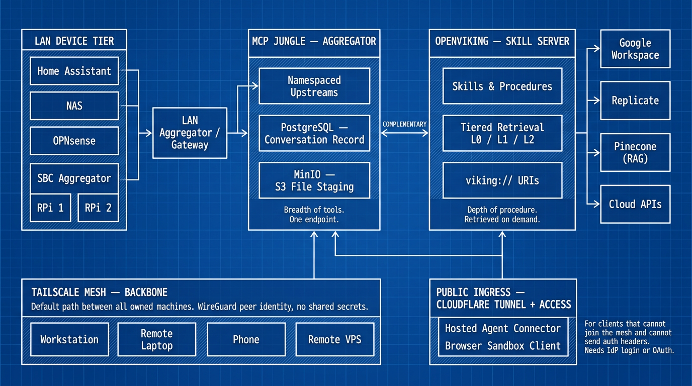

# MCP Deployment Architecture

Living documentation of the MCP (Model Context Protocol) deployment architecture used across Daniel Rosehill's agentic AI setup.

This repository describes the **current** architecture. Dated snapshots of earlier iterations live under [`iterations/`](iterations/), and a version-to-version diff in [`CHANGELOG.md`](CHANGELOG.md) — the README is kept clean of changelog so it always shows the latest model.

**Current version: v3** ([snapshot](iterations/v3-2026-07-27.md)) — the overlay mesh is the backbone; the public tunnel is retained for third-party ingress; a skill server sits alongside the aggregator.

## What this repo is

This is a documentation repository, not a code repository. It captures the current shape of the deployment, the reasoning behind it, and — under `iterations/` — the trajectory.

The architecture is a **work in progress** that is updated periodically. Approaches change as MCP itself evolves and as the practical edges of file transfer, authentication, tool discovery, and aggregation push back.

## Goals

The end goal — not yet fully realised — is an MCP deployment **decoupled from any single agentic framework**. Today, much of it is consumed via Claude (Code and claude.ai), but the design intent is that the MCP servers, aggregation layer, and supporting services should be reusable from any compliant client.

The recurring problem areas this architecture is trying to address:

- **File transfer** — MCP's JSON-RPC has no binary channel; tools that take file paths assume server-local filesystems.
- **Authentication** — managing OAuth, tokens, and per-account scoping across many providers and machines.
- **Tool discovery** — finding the right tool across dozens of servers without overwhelming the model's context.
- **Aggregation vs. direct connection** — when to multiplex through an aggregator and when a direct client connection is simpler.

## Current architecture

### Single LAN aggregator

A single MCP aggregator runs on a virtual machine on the LAN. It is the destination for all MCP servers unless one truly cannot run remotely.

Hosts connections to remote SaaS APIs (Google Workspace, Replicate, Pinecone, Meno, etc.) and to infrastructure services on the Docker network (e.g., PostgreSQL for conversation records). The aggregation layer is **MCP Jungle** (formerly MetaMCP).

### Workstation — direct connections only

There is **no workstation-local aggregator**. The desktop client makes **direct point-to-point connections** to the small set of servers that genuinely have to run locally:

- MCPs that require **local device access** (e.g., Blender, Revit, anything driving local desktop software).
- MCPs that need **direct local filesystem access** and have no remote-file-transfer story.
- MCPs that are simply **too cumbersome to configure remotely** (e.g., transcription tools expecting local audio hardware).

Everything else lives on the LAN aggregator.

### File staging — MinIO on the LAN server

File transfer for MCP tools is handled by **MinIO** running on the LAN VM:

- **S3-compatible API** accessible from inside and outside the LAN.
- **Presigned URLs** for clients without filesystem access (phones, browsers, remote agents).
- **Lifecycle / retention policies** auto-prune temporary staging artifacts so storage doesn't accumulate.

This replaces an earlier lightweight HTTP staging microservice (see [`iterations/v1-2026-04-26.md`](iterations/v1-2026-04-26.md)).

### Skill server — progressive capability retrieval

An aggregated catalog large enough to be worth having is also large enough that loading every tool definition into every session becomes the dominant context cost. Configuring per project which servers to attach is the obvious alternative, and it is both time-consuming to maintain and inflexible the moment a session needs something the list did not anticipate.

A **skill server** answers this from the other side. It holds capability definitions — skills, procedures, conventions — and serves them **on demand**: the agent searches for what the task needs and retrieves only that, rather than mounting everything up front.

The implementation in use is [**OpenViking**](https://github.com/volcengine/OpenViking), a context database that treats memory, resources and skills as a traversable filesystem addressed by `viking://` URIs, with tiered retrieval — abstracts first, full content only when asked for.

**Skill server and aggregator are complementary, not competing:**

| | **MCP aggregator** | **Skill server** |
|---|---|---|
| Supplies | Tools — the ability to *act* | Procedures — the judgement about *how* |
| Answers | "What can I call?" | "How is this done here?" |
| Loading | Tool definitions, resident in context | Retrieved on demand, transient |
| Cost of breadth | Paid every session, in context | Paid only when retrieved |

The aggregator gives breadth of access through one endpoint. The skill server gives depth of know-how without paying for it up front. A skill describing how to file an invoice is worthless without an invoicing tool to call; a large tool catalog with no procedural layer forces every session to rediscover the same sequences.

### Networking — mesh backbone, tunnel for third-party ingress

**Every machine the operator owns is on the tailnet, and that is the default path between them.** Both ends are already mutually authenticated by WireGuard keys, so no bearer token is pasted into client configs, nothing is rotated by hand, revocation is per device, and local traffic never leaves the building. A DNS name for an owned service is an unproxied A record pointing at the overlay IP.

Because the client uses the same overlay address from everywhere, the split-horizon DNS "anti-hairpin" workaround documented in v2 is no longer needed — there is no second address to hairpin to.

**Public tunnel ingress is retained deliberately.** A third-party MCP client — a hosted-agent connector, anything in a browser sandbox — cannot join the mesh, and typically **cannot send custom authentication headers either**: the connector UI takes a URL and expects the endpoint to authenticate the caller itself. For that class of client a mesh-only endpoint is both unreachable and unauthenticatable, so going mesh-only would foreclose those integrations silently.

This has a consequence for how the public endpoint is secured: a service token is the wrong instrument, because sending it is precisely what the client cannot do. Public ingress needs auth the client can complete unaided — an identity-provider login it can render, or OAuth on the MCP server itself, as the MCP spec expects of a remote server.

> Mesh is the backbone and the default for everything you own. The tunnel is the ingress for clients that can be neither on the mesh nor trusted to send a header.

### LAN device integration

Lightweight MCP servers run directly on local LAN devices:

- **Home Assistant** (home automation)
- **NAS** (network storage)
- **OPNsense** (firewall/router)
- **SBC Aggregator** — a dedicated single-board computer that aggregates signals from other SBCs (RPi 1, RPi 2, etc.)

These device-level MCPs feed into a **LAN Aggregator/Gateway**, which connects upward into the VM aggregator. Devices expose only their own tools; the aggregator composes them into a unified interface.

## Design rationale

### Client portability

Centralising MCPs on a network-hosted VM rather than on any single client device means the tool surface is available to any compliant AI client — desktop apps, CLI tools, remote agents — without per-client configuration. New clients just point at the aggregator.

### Location flexibility

One overlay address reaches the same MCP servers from the LAN, from a café, or from a phone — no VPN juggling, no port forwarding, and no split-horizon DNS to keep local traffic local. "Where am I?" stops being an input to the client's configuration.

### Mitigating tool bloat and context load

Two mechanisms attack this from opposite directions.

**Hierarchical aggregation** reduces the tool *count* reaching any one client:

- LAN devices expose focused, narrow tool sets.
- The LAN aggregator/gateway composes device tools into logical groups.
- The VM aggregator presents a curated surface to clients.
- The workstation handles only the exceptions that genuinely need local access — and now does so via direct connections rather than a second aggregator layer.

**Progressive retrieval** reduces everything else. The skill server holds the instructions, conventions and worked sequences that would otherwise have to live in a permanently-loaded system prompt, and hands over only what the current task asks for.

Together they keep a client's context window free of both hundreds of irrelevant tools and thousands of words of irrelevant procedure.

## Component map

The generic role, and what currently fills it:

| Role | Implementation | Notes |
|---|---|---|
| MCP aggregation | [MCP Jungle](https://github.com/mcpjungle/mcpjungle) | One endpoint, per-upstream namespacing. Formerly MetaMCP. |
| Skill server | [OpenViking](https://github.com/volcengine/OpenViking) | Progressive, on-demand retrieval; `viking://` URIs. |
| Overlay mesh (backbone) | Tailscale | Default path between all owned machines. |
| Public ingress | Cloudflare Tunnel + Access | For clients that can join neither the mesh nor send headers. |
| File staging | MinIO | S3 API, presigned URLs, lifecycle policies. |
| Device tier | Home Assistant, OPNsense, NAS, SBCs | Narrow, device-local tool sets. |
| Primary clients | Claude Code, claude.ai | Design intent is client-agnostic; see Goals. |

## Iterations

Dated snapshots of earlier versions of this architecture live in [`iterations/`](iterations/). See that folder's README for the index.

## Diagrams

Diagrams are kept under [`diagrams/`](diagrams/), versioned in step with the iterations:

- `diagrams/v3/1-clean.png` — current architecture (header image above): mesh backbone, tunnel ingress, skill server alongside the aggregator
- `diagrams/v3/2-single-server-variant.png` — same model drawn with the aggregator and skill server on one host, which is how they are in fact co-located
- `diagrams/v2/` — tunnel-and-mesh-as-peers model, with the split-horizon anti-hairpin annotation
- `diagrams/v1/` — earlier two-tier model with workstation-local aggregator and HTTP staging service

All diagrams generated with **Nano Banana 2** (`fal-ai/nano-banana-2`) via Fal AI.
