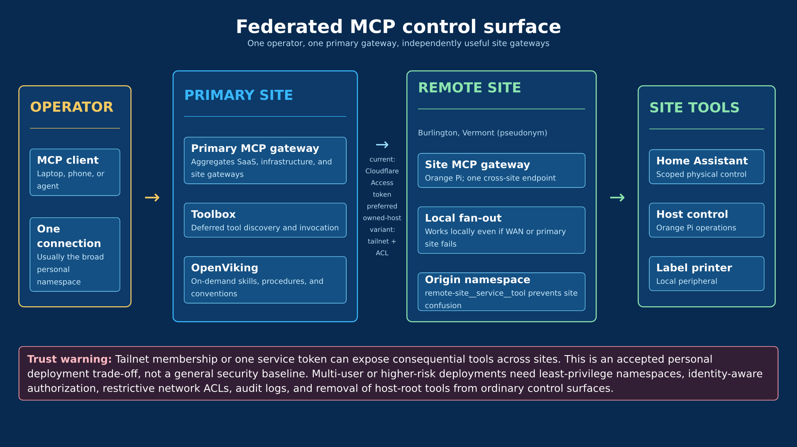
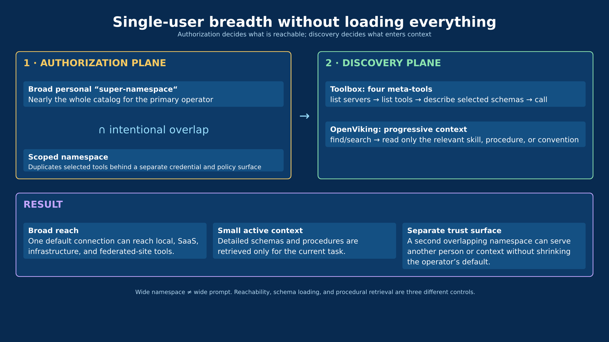
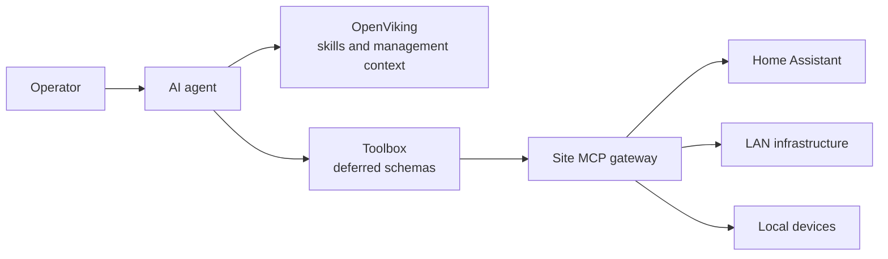
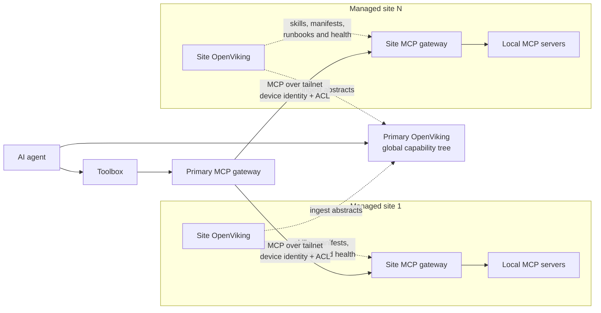

# MCP Deployment Architecture

Living documentation of the MCP (Model Context Protocol) deployment architecture used across Daniel Rosehill's agentic AI setup.

This repository describes the **current** architecture. Dated snapshots of earlier iterations live under [`iterations/`](iterations/), and a version-to-version diff in [`CHANGELOG.md`](CHANGELOG.md) — the README is kept clean of changelog so it always shows the latest model.



**Current version: v4** ([snapshot](iterations/v4-2026-08-13.md)) — independently useful site gateways can federate into the primary gateway, while broad single-user reach is kept context-efficient through deferred tool discovery and OpenViking.

## What this repo is

This is a documentation repository, not a code repository. It captures the current shape of the deployment, the reasoning behind it, and — under `iterations/` — the trajectory.

The architecture is a **work in progress** that is updated periodically. Approaches change as MCP itself evolves and as the practical edges of file transfer, authentication, tool discovery, and aggregation push back.

## Goals

The end goal — not yet fully realised — is an MCP deployment **decoupled from any single agentic framework**. Today, much of it is consumed via Claude (Code and claude.ai), but the design intent is that the MCP servers, aggregation layer, and supporting services should be reusable from any compliant client.

The recurring problem areas this architecture is trying to address:

- **File transfer** — MCP's JSON-RPC has no binary channel; tools that take file paths assume server-local filesystems.
- **Authentication** — managing OAuth, tokens, and per-account scoping across many providers and machines.
- **Tool discovery** — finding the right tool across dozens of servers without overwhelming the model's context.
- **Aggregation vs. direct connection** — when to multiplex through an aggregator and when a direct client connection is simpler.

## Current architecture

### Primary-site aggregator

A primary MCP aggregator runs on the home LAN. It is the default destination for SaaS, infrastructure and device-level MCP servers, and the normal connection point for the operator's clients.

Hosts connections to remote SaaS APIs (Google Workspace, Replicate, Pinecone, Meno, etc.) and to infrastructure services on the Docker network (e.g., PostgreSQL for conversation records). The aggregation layer is **MCP Jungle** (formerly MetaMCP).

The word *primary* is deliberate. v4 no longer assumes that one gateway must fan out directly to every device everywhere. A remote physical site may run its own small gateway and register that gateway as one upstream of the primary. The primary remains the operator-facing control surface; the remote gateway owns local fan-out and can remain useful to clients at that site if the WAN or primary site is unavailable.

### Workstation — direct connections only

There is **no workstation-local aggregator**. The desktop client makes **direct point-to-point connections** to the small set of servers that genuinely have to run locally:

- MCPs that require **local device access** (e.g., Blender, Revit, anything driving local desktop software).
- MCPs that need **direct local filesystem access** and have no remote-file-transfer story.
- MCPs that are simply **too cumbersome to configure remotely** (e.g., transcription tools expecting local audio hardware).

Everything else lives on the LAN aggregator.

### File staging — MinIO on the LAN server

File transfer for MCP tools is handled by **MinIO** running on the LAN VM:

- **S3-compatible API** accessible from inside and outside the LAN.
- **Presigned URLs** for clients without filesystem access (phones, browsers, remote agents).
- **Lifecycle / retention policies** auto-prune temporary staging artifacts so storage doesn't accumulate.

This replaces an earlier lightweight HTTP staging microservice (see [`iterations/v1-2026-04-26.md`](iterations/v1-2026-04-26.md)).

### Progressive discovery — toolbox and skill server

An aggregated catalog large enough to be worth having is also large enough that loading every tool definition into every session becomes the dominant context cost. Configuring per project which servers to attach is the obvious alternative, and it is both time-consuming to maintain and inflexible the moment a session needs something the list did not anticipate.

A **skill server** answers the procedural part of this problem. It holds skills, procedures and conventions and serves them **on demand**: the agent searches for what the task needs and retrieves only that, rather than mounting everything up front.

The implementation in use is [**OpenViking**](https://github.com/volcengine/OpenViking), a context database that treats memory, resources and skills as a traversable filesystem addressed by `viking://` URIs, with tiered retrieval — abstracts first, full content only when asked for.

Tool discovery itself uses a separate **toolbox meta-MCP**. Its four bootstrap tools let an agent list servers, list matching tools, request full schemas only for selected tools, and invoke them. OpenViking therefore does not replace the gateway or act as the tool router: it retrieves the know-how for using capabilities, while the toolbox progressively reveals and calls the capabilities themselves.

**Skill server and aggregator are complementary, not competing:**

| | **MCP aggregator** | **Toolbox** | **OpenViking** |
|---|---|---|---|
| Supplies | Reachable tools | Deferred tool discovery and invocation | Procedures and conventions |
| Answers | "What am I allowed to reach?" | "What can I call for this task?" | "How is this done here?" |
| Loading | Namespace exposes the reachable catalog | Selected schemas retrieved on demand | Selected context retrieved on demand |
| Cost of breadth | Tool names remain a known connection cost | Full schemas paid only when selected | Full procedure paid only when read |

The aggregator gives breadth of access through one endpoint. The toolbox keeps that breadth callable without mounting every detailed schema. OpenViking gives depth of know-how without paying for it up front. A skill describing how to file an invoice is worthless without an invoicing tool to call; a large tool catalog with no procedural layer forces every session to rediscover the same sequences.



### Networking — mesh backbone, tunnel for third-party ingress

**Every machine the operator owns is on the tailnet, and that is the default path between them.** Both ends are already mutually authenticated by WireGuard keys, so no bearer token is pasted into client configs, nothing is rotated by hand, revocation is per device, and local traffic never leaves the building. A DNS name for an owned service is an unproxied A record pointing at the overlay IP.

Because the client uses the same overlay address from everywhere, the split-horizon DNS "anti-hairpin" workaround documented in v2 is no longer needed — there is no second address to hairpin to.

**Public tunnel ingress is retained deliberately.** A third-party MCP client — a hosted-agent connector, anything in a browser sandbox — cannot join the mesh, and typically **cannot send custom authentication headers either**: the connector UI takes a URL and expects the endpoint to authenticate the caller itself. For that class of client a mesh-only endpoint is both unreachable and unauthenticatable, so going mesh-only would foreclose those integrations silently.

This has a consequence for how the public endpoint is secured: a service token is the wrong instrument, because sending it is precisely what the client cannot do. Public ingress needs auth the client can complete unaided — an identity-provider login it can render, or OAuth on the MCP server itself, as the MCP spec expects of a remote server.

> Mesh is the backbone and the default for everything you own. The tunnel is the ingress for clients that can be neither on the mesh nor trusted to send a header.

### LAN device integration

Lightweight MCP servers run directly on local LAN devices:

- **Home Assistant** (home automation)
- **NAS** (network storage)
- **OPNsense** (firewall/router)
- **SBC Aggregator** — a dedicated single-board computer that aggregates signals from other SBCs (RPi 1, RPi 2, etc.)

These device-level MCPs feed into a **LAN Aggregator/Gateway**, which connects upward into the VM aggregator. Devices expose only their own tools; the aggregator composes them into a unified interface.

### Federated remote-site gateways

v4 extends the same composition pattern across geography. A small, independently administered site runs one MCP gateway close to its devices. The primary gateway registers the entire site gateway as a single upstream, so one cross-site connection carries the remote site's control surface and the remote gateway fans out locally.

Using **Burlington, Vermont** as a pseudonym for the deployed U.S. site, an illustrative Home Assistant call is:

```text
operator → primary MCP gateway → remote-site upstream
         → Burlington MCP gateway → Home Assistant MCP server → device
```

The deployed site gateway runs on an Orange Pi and currently fronts Home Assistant, host-control and label-printer tools. It remains directly usable on its own LAN; federation adds global reach without making local operation depend on the primary site.

The outer gateway preserves the remote gateway's own tool prefix, producing names such as `burlington__home-assistant__HassTurnOff`. The double prefix is a safety property, not cosmetic namespacing: the primary gateway also has its own `home-assistant__*`, `box-control__*` and printer tools, so the site of effect must remain visible at selection and invocation time.

Only the gateway-to-gateway hop crosses the wide-area link. This reduces configuration at the primary site, retains the remote site's internal grouping, and avoids multiple routes to the same consequential tool. It is mainly an availability and administrative-boundary pattern; measured transatlantic latency is well below the MCP initialization timeout and is not the architectural justification.

#### The deployed path and the tailnet variant

The current deployment reaches the remote gateway through a **Cloudflare Tunnel protected by an Access service token**. The Orange Pi also exposes the gateway on its tailnet address, but the primary gateway does not presently use that path because MagicDNS resolution from its container is unreliable and a changing tailnet IP would fail less clearly than an expired Access token.

For two owned machines, a direct tailnet path remains the preferred generic variant when name resolution, stable addressing and ACLs are dependable. In that design the flow is authenticated by device identity and restricted by tailnet policy. Merely joining both machines to a default-allow tailnet should not be mistaken for application-level authorization.

#### Security boundary and limits

This deployment is optimized for one operator who accepts a large personal trust domain. A tailnet member or holder of the relevant service token may reach physical-control and, in some cases, host-root tools across sites. That is suitable here as a conscious personal trade-off; it is **not a generally viable security baseline**.

A multi-user, organizational or higher-consequence deployment should add, at minimum:

- least-privilege namespaces that exclude shell, router and unrelated site controls;
- identity-aware authorization at each gateway, rather than treating network presence alone as sufficient;
- restrictive tailnet ACLs or grants between named workloads and ports;
- per-site and per-principal credentials with rotation and revocation;
- auditable tool calls and approval gates for destructive or physical actions; and
- an explicit policy for which prompts, resources and tools may traverse gateway boundaries.

### Two reference network configurations

The architecture now distinguishes a baseline deployment from its extended form.

#### A. Single-site network

One site gateway aggregates the MCP servers on one LAN. The operator's agent uses OpenViking to retrieve skills and management procedures, uses the toolbox to reveal only the selected tool schema, and invokes the tool through that gateway.


```mermaid
flowchart LR
    User[Operator] --> Agent[AI agent]
    Agent --> OV[OpenViking<br/>skills and management context]
    Agent --> Box[Toolbox<br/>deferred schemas]
    Box --> GW[Site MCP gateway]
    GW --> HA[Home Assistant]
    GW --> Infra[LAN infrastructure]
    GW --> Devices[Local devices]
```

This is the v3-style single-network model expressed with the v4 distinction between procedural discovery, schema discovery and execution.

#### B. Extended managed-site network

The extended model repeats the same site unit behind a primary management surface. Each on-prem location has a site gateway and, in the idealized design, a site-local OpenViking instance. The primary gateway registers each site gateway as one upstream. Gateway-to-gateway execution runs over **Tailscale**, where machine identity authenticates the peers and restrictive ACLs or grants authorize only the necessary source, destination and port.


```mermaid
flowchart LR
    Agent[AI agent] --> POV[Primary OpenViking<br/>global capability tree]
    Agent --> Box[Toolbox]
    Box --> PGW[Primary MCP gateway]

    subgraph S1[Managed site 1]
      OV1[Site OpenViking] -. skills, manifests,<br/>runbooks and health .-> GW1[Site MCP gateway]
      GW1 --> T1[Local MCP servers]
    end

    subgraph SN[Managed site N]
      OVN[Site OpenViking] -. skills, manifests,<br/>runbooks and health .-> GWN[Site MCP gateway]
      GWN --> TN[Local MCP servers]
    end

    OV1 -. ingest abstracts .-> POV
    OVN -. ingest abstracts .-> POV
    PGW -->|MCP over tailnet<br/>device identity + ACL| GW1
    PGW -->|MCP over tailnet<br/>device identity + ACL| GWN
```

The number of managed sites is logically unbounded: each new site contributes one gateway upstream, one origin prefix and one capability subtree. “Unbounded” is a topology property, not a claim of infinite operational capacity. Real limits appear in catalog cardinality, synchronization lag, ACL and credential administration, observability, latency, upgrade coordination and failure isolation.

The current Orange Pi does **not** run site-local OpenViking because of memory pressure. The diagram intentionally documents the target architecture rather than freezing that hardware compromise into the design.

OpenViking does not need to proxy tool execution. It is the progressive discovery and management-knowledge plane:

- each site publishes capability manifests, skills, runbooks, naming/provenance and health or recovery context;
- an ingest process mirrors lightweight site abstracts and selected resources into the primary OpenViking tree;
- the agent searches one global tree, then reads only the selected site's full procedure;
- management skills identify the relevant gateway-admin tools and safe sequence, while those MCP tools—not OpenViking itself—perform registration, health checks or remediation; and
- the site-local catalog remains usable by local agents when disconnected from the primary site.

This synchronization is an architectural integration layer; it does not assume that OpenViking provides native multi-node federation or multi-master replication.

### Progressive discovery to execution

An idealized request flows as follows:

1. The user states an intent to an AI agent without naming a site or tool.
2. The agent searches the primary OpenViking catalog. It initially receives lightweight capability abstracts, site provenance, skill URIs and tool locators—not every runbook or schema.
3. The agent reads the one selected skill. That resource supplies the procedure, constraints, required authorization surface, approval rules, verification steps and namespaced tool locator.
4. If fresh site-specific state is required, the agent retrieves the relevant manifest or health context from the site management subtree.
5. The agent uses the toolbox to list or resolve the candidate tool, requests only its detailed schema, and invokes it.
6. The primary gateway enforces the user's namespace and routes the namespaced call over Tailscale to the chosen on-prem gateway.
7. The site gateway invokes the local MCP server; the result returns along the same route.
8. The agent verifies the outcome and may store a durable observation or improved procedure in OpenViking.

The context expands progressively: **capability abstract → one skill → one schema → one result**. The agent never needs every site's tools, schemas and operational handbook in the active prompt.

## Design rationale

### Client portability

Centralising MCPs on a network-hosted VM rather than on any single client device means the tool surface is available to any compliant AI client — desktop apps, CLI tools, remote agents — without per-client configuration. New clients just point at the aggregator.

### Location flexibility

One overlay address reaches the same MCP servers from the LAN, from a café, or from a phone — no VPN juggling, no port forwarding, and no split-horizon DNS to keep local traffic local. "Where am I?" stops being an input to the client's configuration.

### Mitigating tool bloat and context load

Two mechanisms attack this from opposite directions.

**Hierarchical aggregation** reduces the tool *count* reaching any one client:

- LAN devices expose focused, narrow tool sets.
- The LAN aggregator/gateway composes device tools into logical groups.
- The VM aggregator presents a curated surface to clients.
- The workstation handles only the exceptions that genuinely need local access — and now does so via direct connections rather than a second aggregator layer.

**Progressive retrieval** reduces everything else. The toolbox reveals detailed tool schemas only as they are selected, while OpenViking hands over only the instructions, conventions and worked sequences that the current task asks for.

Together they keep a client's context window free of both hundreds of irrelevant tools and thousands of words of irrelevant procedure.

### Single-user namespace model

This deployment mostly serves one operator, so its default namespace behaves as a **super-namespace**: nearly every owned capability is reachable from one client connection, including the federated remote site. That breadth is intentional. It avoids per-project MCP declarations and allows an exploratory session to discover a capability that was not anticipated when the session began.

A second, narrower namespace may intentionally duplicate some of those tools. The duplicate membership is not waste or a tool-organization technique; it creates a separate authentication and policy surface for another person or context. A household namespace, for example, can expose Home Assistant and shared utilities without exposing the operator's business, infrastructure or host-control catalog. The broad personal namespace does not need to shrink to make that possible.

Three controls must remain distinct:

1. **Namespace membership controls reachability.** It answers which principal or trust context may access a server or tool.
2. **The toolbox controls schema loading.** A minimal four-tool endpoint progressively lists, describes and invokes tools from the broad catalog.
3. **OpenViking controls procedural context.** It progressively retrieves the relevant skill, procedure or convention through `find`/`search` and `read`.

The result is a wide control surface without requiring the full tool schemas and operational handbook to be resident in every prompt. There is still a known cost for advertising tool names in a broad namespace; clients requiring the smallest possible bootstrap context can connect to the toolbox-only namespace instead.

## Component map

The generic role, and what currently fills it:

| Role | Implementation | Notes |
|---|---|---|
| MCP aggregation | [MCP Jungle](https://github.com/mcpjungle/mcpjungle) | One endpoint, per-upstream namespacing. Formerly MetaMCP. |
| Deferred tool discovery | Toolbox meta-MCP | Four bootstrap tools: list servers/tools, describe selected schemas, invoke. |
| Skill server | [OpenViking](https://github.com/volcengine/OpenViking) | Progressive retrieval of skills, procedures and conventions; `viking://` URIs. |
| Overlay mesh (backbone) | Tailscale | Default path between all owned machines. |
| Public ingress | Cloudflare Tunnel + Access | For clients that can join neither the mesh nor send headers. |
| File staging | MinIO | S3 API, presigned URLs, lifecycle policies. |
| Device tier | Home Assistant, OPNsense, NAS, SBCs | Narrow, device-local tool sets. |
| Remote-site tier | MCP Jungle on an Orange Pi | One site endpoint; local fan-out; origin-preserving double prefixes. |
| Primary clients | Claude Code, claude.ai | Design intent is client-agnostic; see Goals. |

## Iterations

Dated snapshots of earlier versions of this architecture live in [`iterations/`](iterations/). See that folder's README for the index.

## Diagrams

Diagrams are kept under [`diagrams/`](diagrams/), versioned in step with the iterations. v4 diagrams include editable Typst source alongside rendered PNGs:

- `diagrams/v4/1-federated-sites.typ` / `.png` — primary-to-remote gateway federation, local fan-out and trust warning
- `diagrams/v4/2-context-efficiency.typ` / `.png` — super-namespace, overlapping auth surface, toolbox and OpenViking
- `diagrams/v3/1-clean.png` — v3 architecture: mesh backbone, tunnel ingress, skill server alongside the aggregator
- `diagrams/v3/2-single-server-variant.png` — same model drawn with the aggregator and skill server on one host, which is how they are in fact co-located
- `diagrams/v2/` — tunnel-and-mesh-as-peers model, with the split-horizon anti-hairpin annotation
- `diagrams/v1/` — earlier two-tier model with workstation-local aggregator and HTTP staging service

v1–v3 diagrams were generated with **Nano Banana 2** (`fal-ai/nano-banana-2`) via Fal AI. v4 diagrams are reproducible Typst sources rendered with Typst 0.14.

## Architecture as code

The narrative and diagrams are backed by a versioned architecture model under [`architecture/`](architecture/):

- [`architecture/v4/model.yaml`](architecture/v4/model.yaml) — canonical component, namespace, relationship, invariant and security model;
- [`architecture/v4/topology.md`](architecture/v4/topology.md) — GitHub-rendered Mermaid deployment and control-flow view; and
- [`architecture/v4/context-efficiency.md`](architecture/v4/context-efficiency.md) — GitHub-rendered Mermaid authorization and progressive-discovery view.
- [`architecture/v4/single-site.md`](architecture/v4/single-site.md) — baseline single-network deployment;
- [`architecture/v4/extended-sites.md`](architecture/v4/extended-sites.md) — idealized Tailscale-authenticated `N`-site deployment; and
- [`architecture/v4/progressive-execution.md`](architecture/v4/progressive-execution.md) — sequence from user intent through discovery and execution.

An ERD was considered but rejected because the important relationships are deployment, trust and control-flow relationships rather than relational data constraints. The YAML graph is the authoritative code representation; Mermaid and Typst are reviewable views, and the prose records rationale.
