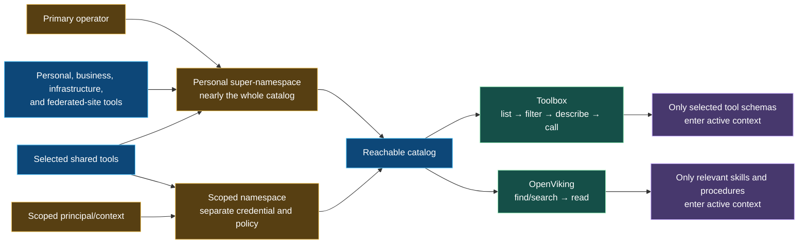

# v4 authorization and context-efficiency model

The three controls are independent:

1. Namespace membership determines what a principal can reach.
2. Toolbox determines which detailed tool schemas are loaded and invoked.
3. OpenViking determines which procedures and conventions are retrieved.
