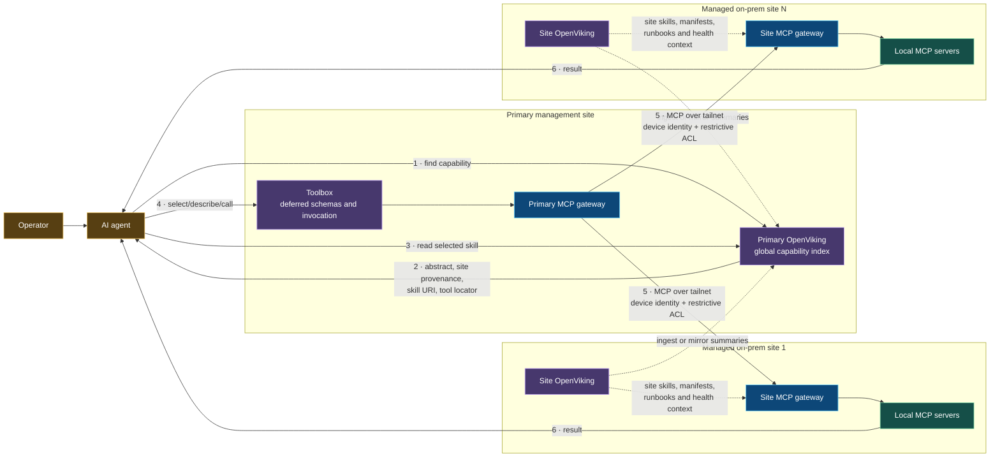

# Reference deployment B — extended managed-site network

Each additional site contributes one gateway upstream and one capability subtree, not a new client connection. The topology is logically extensible to an arbitrary number of managed sites. Practical scale is bounded by catalog cardinality, synchronization, policy administration, observability, latency, and failure isolation.

OpenViking federation here is an **architecture pattern**, not a claim of native OpenViking multi-node replication. A scheduled or event-driven ingest layer mirrors site abstracts and selected resources into the primary catalog. Site-local OpenViking remains useful to local agents when the WAN is unavailable.
