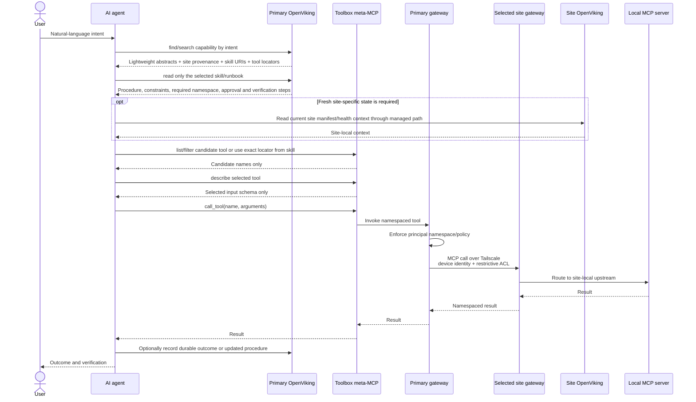

# Idealized progressive discovery-to-execution flow

At no point must the agent load every site, tool schema, or runbook. It expands context in stages: capability abstracts, one selected skill, one selected schema, then one execution path.
