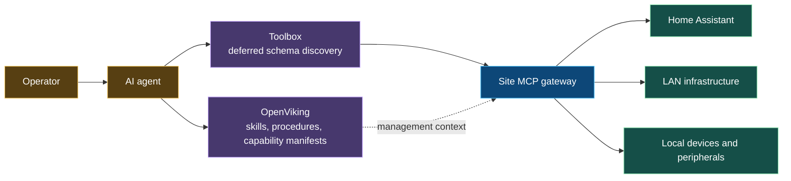

# Reference deployment A — single-site network

One gateway owns one LAN control surface. OpenViking and the toolbox are logically separate from execution: OpenViking retrieves the relevant skill and management context; the toolbox retrieves only the selected tool schema; the gateway routes the call.
