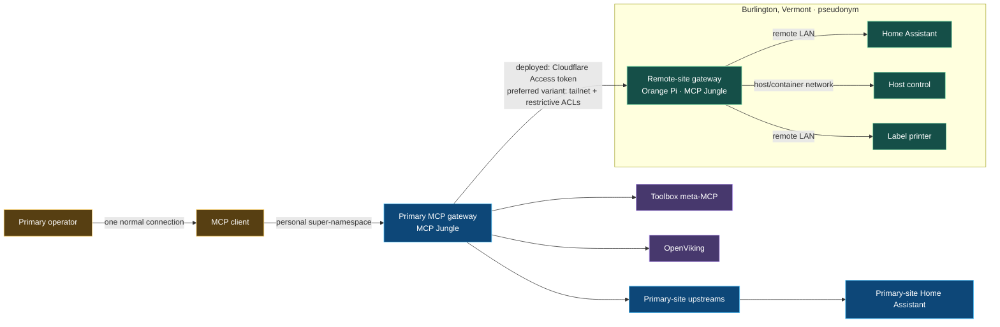

# v4 deployment and control topology

```mermaid
flowchart LR
    operator[Primary operator] -->|one normal connection| client[MCP client]
    client -->|personal super-namespace| primary[Primary MCP gateway<br/>MCP Jungle]

    primary --> toolbox[Toolbox meta-MCP]
    primary --> viking[OpenViking]
    primary --> local[Primary-site upstreams]

    primary -->|deployed: Cloudflare Access token<br/>preferred variant: tailnet + restrictive ACLs| remote[Remote-site gateway<br/>Orange Pi · MCP Jungle]

    subgraph burlington["Burlington, Vermont · pseudonym"]
        remote -->|remote LAN| ha[Home Assistant]
        remote -->|host/container network| host[Host control]
        remote -->|remote LAN| printer[Label printer]
    end

    local --> localha[Primary-site Home Assistant]

    classDef principal fill:#573f12,stroke:#f8cb62,color:#fff;
    classDef primary fill:#0d4778,stroke:#52c7ff,color:#fff;
    classDef remote fill:#154f48,stroke:#8ee6b0,color:#fff;
    classDef context fill:#47386d,stroke:#c5a7ff,color:#fff;
    class operator,client principal;
    class primary,local,localha primary;
    class remote,ha,host,printer remote;
    class toolbox,viking context;
```

The remote gateway is registered as one upstream. Its tools retain an origin-preserving double prefix such as `burlington__home-assistant__HassTurnOff`.
